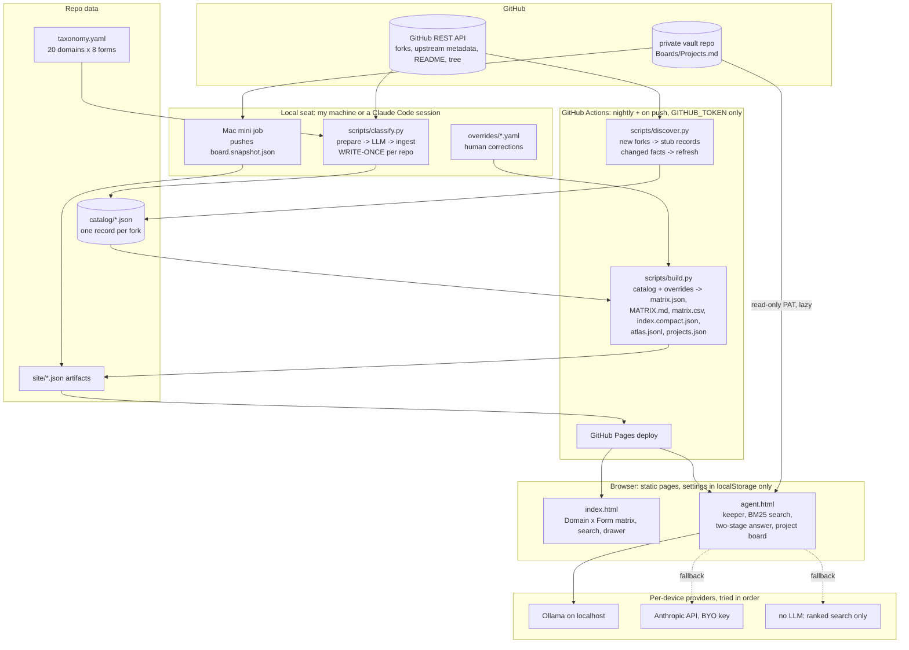

# fork-atlas


[](https://github.com/tbalt88/fork-atlas/actions/workflows/atlas.yml)


*This system is part of the working record behind my [AIDLC series](https://www.linkedin.com/in/dexterdomingo/) on AI-driven development.*

A self-updating catalog of every GitHub repository I have forked (plus my own public repos,
marked "own"), classified into a Domain x Form matrix with a one-shot LLM abstraction and keyword-tagged use cases, plus an
assistant page that answers "I want to build X that does a, b, c. Which of my forks apply,
and why?" from that catalog. It runs on GitHub Actions and Pages with no server, no
database, and no secrets in the repo.

The name: an atlas is a book of maps you keep to find your way back. Forks are the places I
meant to return to.

**Live:** [matrix](https://tbalt88.github.io/fork-atlas/) · [assistant](https://tbalt88.github.io/fork-atlas/agent.html) · [MATRIX.md](MATRIX.md) (rendered here) · [matrix.json](matrix.json) · [matrix.csv](matrix.csv)

### Table of Contents

- [Why this repo holds no secrets](#why-this-repo-holds-no-secrets)
- [Architecture](#architecture)
- [Write-once classification](#write-once-classification)
- [Taxonomy with a review loop](#taxonomy-with-a-review-loop)
- [The assistant: two-stage retrieval, three provider tiers](#the-assistant-two-stage-retrieval-three-provider-tiers)
- [Project board from the vault](#project-board-from-the-vault)
- [Engineering notes](#engineering-notes)
- [Practices](#practices)
- [Setup](#setup)
- [Testing and verification](#testing-and-verification)
- [For hiring managers](#for-hiring-managers)

## Why this repo holds no secrets

The catalog is public because every fork it describes is already public. What stays out is
anything that could act on my behalf. The GitHub Action holds only the built-in
`GITHUB_TOKEN` and does discovery, build and deploy. LLM classification never runs in CI: it
runs on my machine (`scripts/classify.py run` with a key in my shell) or inside a Claude Code
session that fans the work out to subagents. The assistant page keeps every credential (an
Ollama endpoint, an optional Anthropic key, an optional read-only GitHub token for the
project board) in the browser's `localStorage` on the device that entered it. Nothing in
`site/` reads a secret from anywhere else. `.classify-inputs/` (READMEs and file trees pulled
for classification) is gitignored.

<p align="right">(<a href="#fork-atlas">back to top</a>)</p>

## Architecture



Every box maps to a file. `scripts/common.py` holds the GitHub client and record helpers
shared by the three scripts. `site/js/retrieval.js` is the BM25 index, `site/js/llm.js`
the provider adapters, `site/js/prompts.js` the two prompts and JSON schemas,
`site/js/board.js` the vault board loader, `site/js/private.js` the live private-repo
merge, `site/js/agent.js` the orchestration.
`.github/workflows/atlas.yml` is the whole CI.

<p align="right">(<a href="#fork-atlas">back to top</a>)</p>

## Write-once classification

The load-bearing decision. Repositories do not change what they *are* from day to day, so
the expensive, judgment-heavy step happens exactly once per fork and is never overwritten by
automation. `discover.py` stubs a new fork as `unclassified`; `classify.py` fills the
`classification` block once and skips any record that already has one:

```python
def eligible(recs, only=None, force=False):
    for r in recs:
        if r.get("status") == "gone":
            continue
        if only and r["fork"]["full_name"] != only and r["upstream"].get("full_name") != only:
            continue
        if r.get("classification") and not force:
            continue
        yield r
```

`scripts/classify.py`, `eligible()`. Re-running a repo is an explicit `--force`. Daily
discovery touches API facts only (stars, last push, archived, upstream deleted), and since
`discover.py` compares the record minus its `meta` block before writing, a quiet night is a
zero-file diff.

Each record carries: `domain`, `form`, `maturity`, a 2 to 4 sentence `analysis`, 3 to 5
`use_cases` (each with its own keywords), 5 to 10 `keywords`, a `confidence`, and the model
that wrote it. The first pass classified all 205 forks in one fan-out: 14 parallel Sonnet
subagents, about 15 repos each, zero stragglers, then `classify.py ingest`. The same script
also runs the whole loop against the Anthropic API from a local shell.

<p align="right">(<a href="#fork-atlas">back to top</a>)</p>

## Taxonomy with a review loop

`taxonomy.yaml` is a controlled vocabulary the classifier must choose from: 20 domains
(LLM inference and training, agents and skills, media generation, data and RAG, security,
business apps, finance and trading, computer vision and sensing, marketing and growth, and
so on) by 8 forms (library, app, CLI, template, skill pack, model or dataset, reference,
service) by 4 maturity levels. When nothing fits, the model may set `proposed_domain`; that
record shows as **needs review** in the viewer instead of silently growing the taxonomy.

The first pass surfaced seven real clusters that the seed taxonomy lacked (`business-apps`,
`finance-trading`, `vision-sensing`, `science-research`, `ai-platforms`, `media-management`,
`marketing-growth`). Each was added by hand and the affected repos routed with an override,
never by re-running the LLM. Overrides are small YAML files that win in the matrix and never
modify `catalog/`:

```yaml
# overrides/tbalt88__open-seo.yaml
domain: marketing-growth
form: app
note: "Reviewed. Intended use: SEO plan for a travel site (keyword research, rank tracking, site audit)."
keywords_add: [seo, keyword-research, site-audit]
```

An override on `domain` or `form` also clears the review flag, so "reviewed by a human" is
a property of the data, not a memory. 28 overrides exist today; the review queue is empty.

<p align="right">(<a href="#fork-atlas">back to top</a>)</p>

## The assistant: two-stage retrieval, three provider tiers

`agent.html` is a static page. Retrieval is two stages, neither of them a vector database:

1. **Lexical.** `retrieval.js` builds a BM25 index in the browser over analysis, use cases,
   keywords, topics and notes, splits the brief into requirements (`a) b) c)`, bullets, or
   clauses), and ranks by how many distinct requirements a repo hits, then by score. This
   stage works with no model at all and is the whole answer in search-only mode.
2. **LLM.** The top 28 to 40 candidates go, as compact one-line summaries from
   `site/index.compact.json`, to a small *shortlist* model that returns up to 12 ids with
   which requirement each covers. The full records of those ids, plus the active projects
   from the vault board, go to a *reasoning* model that must return JSON matching
   `ANSWER_SCHEMA` in `prompts.js`: per requirement, 1 to 3 repos with role, reason,
   caveats and a fit score; a `gaps` list for requirements nothing covers, each with a
   GitHub search query; an architecture note; next actions. Ids the model cites are
   resolved leniently (small models drop the owner prefix), and every answer shows the exact
   records that were in context.

Private repositories never enter the catalog. If a browser holds a read-only token for them,
`private.js` lists them live from GitHub on load, merges them into the search index as
"Private (live)" records, and pulls a README on demand when one is shortlisted for a
question. Nothing about them is written to this repo or to Pages.

Providers are tried in order on each device: Ollama on `localhost` (auto-detected, models
picked from what is installed, structured output via `format`), an Anthropic key held in
that browser (tool-use forced output, streamed), then no LLM. On a laptop the local mode
shrinks the candidate pool and trims record fields, because a 4 GB GPU prefills slowly.

The page is also the runbook: a keeper panel with stat tiles (forks tracked, new this week,
unclassified, needs review, archived) and amber prompts, with a copy button, for the three
things that need a human. That is deliberate hardening against the owner forgetting how the
system works, described in [RUNBOOK.md](RUNBOOK.md).

<p align="right">(<a href="#fork-atlas">back to top</a>)</p>

## Project board from the vault

The assistant's Projects panel is not a list I typed. It mirrors the project board in my
private Obsidian vault (`Boards/Projects.md`, a Kanban auto-generated from `Projects/*.md`
frontmatter). `board.js` loads it lazily, live, from the GitHub contents API using a
fine-grained token scoped to that one repo with Contents: read only, held in the browser;
falls back to the browser's cache of the last live copy; falls back again to
`site/board.snapshot.json`, which is dated so staleness is visible. Active projects ride
along as context for the reasoning stage, so an answer can say a repo fits a project that
is currently active.

<p align="right">(<a href="#fork-atlas">back to top</a>)</p>

## Engineering notes

**Built here.** Everything in `scripts/` and `site/`: 1,932 lines across five Python files,
five JS modules and two HTML pages, in 17 commits. The Python uses the standard library plus
PyYAML; the front end is vanilla ES modules with no bundler, no framework and no fonts or
scripts loaded from anywhere else. There is nothing to compile.

**Inherited.** GitHub's REST API, Actions and Pages; Ollama's `/api/chat` with a JSON schema
`format`; Anthropic's Messages API with forced tool use for structured output. The
`anthropic-dangerous-direct-browser-access` header is Anthropic's own sanctioned mode for
bring-your-own-key pages, and it is the reason a key never has to touch this repo.

**Two things that bit.** A push-triggered build committed a rebuild before the scheduled
run's push, so the scheduled run was rejected as non-fast-forward; the fix is that push
builds never commit and scheduled builds `git pull --rebase` first
(`.github/workflows/atlas.yml`). And the first discovery rewrote all 205 catalog files just to
bump a `metadata_refreshed_at` stamp; `discover.py` now compares the record without `meta`
and only writes when a fact changed (70 of 205 on the retest, all star counts).

**Why not vector RAG.** The corpus is 205 short records. BM25 in the browser plus one small
LLM shortlist call is cheaper, needs no embeddings key at build time, and stays inspectable:
you can see the ranked candidates with the "Search only" button.

<p align="right">(<a href="#fork-atlas">back to top</a>)</p>

## Practices

Each one is marked as code-enforced or a written rule.

| Practice | Enforced by |
|---|---|
| Classification is write-once per repo; automation never overwrites it | code: `classify.py eligible()` skips classified records without `--force` |
| Corrections go in `overrides/`, never by editing `catalog/` | code: `build.py` merges overrides over catalog at build time; written rule not to hand-edit catalog |
| No third-party secrets in the repo or its Actions | written rule; the workflow file references only `secrets.GITHUB_TOKEN` and is the receipt |
| The viewer never depends on Claude or any one LLM | code: static pages read `matrix.json`; provider is a runtime choice with a no-LLM tier |
| The vault is the source of truth for projects; this repo mirrors it | code: the page never writes the board; written rule for the snapshot |
| A human review clears the review flag | code: `build.py` drops `needs_review` when an override sets domain or form |

<p align="right">(<a href="#fork-atlas">back to top</a>)</p>

## Setup

Fork or clone, then edit the GitHub username in `scripts/discover.py` (`--user` default) and
in the workflow. Locally:

```bash
pip install pyyaml
python scripts/discover.py                 # catalog <- GitHub (uses `gh auth token` or GITHUB_TOKEN)
python scripts/classify.py prepare         # gather README + tree for unclassified forks
python scripts/classify.py run             # ...and classify via the Anthropic API (needs ANTHROPIC_API_KEY in your shell)
python scripts/build.py                    # matrix.json, MATRIX.md, matrix.csv, site artifacts
python -m http.server -d site 8080         # http://localhost:8080 and /agent.html
```

`classify.py ingest --label <name>` merges result files written by any external LLM (this is
how a Claude Code fan-out lands). Enable Pages with source "GitHub Actions" and the workflow
does the rest nightly.

Per browser, in the assistant's provider drawer: Ollama needs `OLLAMA_ORIGINS` to include
your Pages origin (it answers 403 otherwise); an Anthropic key and a read-only GitHub token
for a private board are optional. Nothing here can be exercised without a GitHub account;
everything except the LLM answer can be exercised without any LLM.

<p align="right">(<a href="#fork-atlas">back to top</a>)</p>

## Testing and verification

Honest version: there is no automated test suite. This is a single-user tool whose
correctness was verified by running it, and the receipts are in the repo rather than in a
`tests/` folder. The nightly workflow is a real integration run (discover against the live
API, build, deploy) and its badge above is its actual status. The classification pass is
checked by `scripts/stats.py` (distribution and review queue) and by the human review loop
that added seven domains. The assistant was verified in the browser on the deployed URL
against a local Ollama model, in search-only mode, and with an invalid board token to
confirm graceful degradation. Where this tradeoff would stop being fair: the moment a second
person depends on the catalog, or the moment `parseBoard` has to handle a board it did not
see, `retrieval.js` and `board.js` deserve unit tests first.

<p align="right">(<a href="#fork-atlas">back to top</a>)</p>

## For hiring managers

A small, complete system: scheduled data pipeline, controlled-vocabulary LLM classification
with a human review loop, and a static assistant that does two-stage retrieval against a
local or cloud model with no server. The design decisions that cost the most thought are
write-once LLM fields, zero secrets in CI, and degrading to a useful no-LLM mode. Total
build time was one long session with an AI pair, and that session's decisions are the ones
documented above.
